# Data Portfolio: Sales Performance Dashboard (Excel, PostgreSQL, Power BI)

# Table of contents

- [Project Overview](#project-overview)
  - [Objective](#objective)
  - [Business Context](#business-context)
- [Data Collection](#data-collection)
  - [Source](#source)
  - [Structure & Format](#structure-&-format)
- [Data Cleaning & Preparation](#data-cleaning-&-preparation)
  - [Data Types & Formatting](#data-types-&-formatting)
- [SQL Analysis](#dsql-analysis)
  - [Business Questions Answered](#business-questioned-answered)
- [Data Modeling](#data-modeling)
  - [Star Schema Design](#star-schema-design)
  - [Table Relationships](#table-relationships)
- [DAX Calculations](#dax-calculations)
  - [Core Measures](#core-measures)
  - [Time Intelligence](#time-inteligence)
- [Dashboard Design](#dashboard-design)
  - [Visuals Used](#visuals-used)
- [Key Insights](#key-insghts)
  - [Trends Identified](#trends-identified)
  - [Recommendations](#recommendations)

# Project Overview
## Objective
The objective of this project is to develop a dynamic and interactive Power BI dashboard that analyses Superstore sales performance across key business dimensions — including sales, profitability, operations, and product-level insights. This dashboard is designed to support real-time decision-making by providing drill-down capabilities and intuitive visualisations tailored for the Regional Sales Director and other stakeholders.
## Business Context
The organisation currently relies on static, Excel-based reports that are time-consuming to update and offer limited visibility into trends and inefficiencies. As a result, business leaders struggle to:
 - Identify underperforming products or regions in a timely manner
 - Detect profit leaks caused by high discounting or returns
 - Understand seasonal or regional sales trends
 - Optimise operations such as shipping performance and order efficiency

This project addresses those challenges by transforming raw sales data into actionable insights through a clean, easy-to-use dashboard that delivers value across sales, operations, and profitability

# Data Collection
## Source
The dataset used for this project is the publicly available (on Kaggle) Superstore Sales dataset, which simulates a retail company’s historical order data. It contains detailed transactional information on customer orders, product categories, shipping performance, and regional sales.
## Structure & Format
The data was provided in Excel format and included the following key fields:
 - Order Details: Order ID, Order Date, Ship Date, Customer ID, Segment, Region
 - Product Info: Product Name, Category, Sub-Category
 - Sales Metrics: Sales, Quantity, Discount, Profit
 - Shipping Metrics: Shipping Mode, Ship Date, Order Priority

This raw dataset was first cleaned in Excel, then analysed using SQL to answer key business questions, and finally imported into Power BI for data modeling and interactive visualisation.

# Data Cleaning & Preparation
## Data Types & Formatting
Data cleaning was performed in Microsoft Excel before importing the dataset into PostgreSQL. The following steps were taken to ensure consistency and accuracy:
 - Converted Order Date and Ship Date columns into proper date formats
 - Verified that numeric columns such as Sales, Profit, Discount, and Quantity were correctly typed as numbers
 - Standardised text formatting for categorical fields like Region, Segment, Category, and Sub-Category (e.g., removing extra spaces and fixing case mismatches)
## Handling Missing or Duplicate
  - Scanned the dataset for blank cells and filled or removed non-critical ones as appropriate
  - Removed duplicate rows based on Order ID to ensure each transaction was unique
  - Cleaned inconsistent values in fields such as Product Name and Region to prevent grouping errors in Power BI
  - After cleaning, the Excel file was saved as a structured dataset and imported into PostgreSQL for analysis

# SQL Analysis
## Business Questions Answered
Before importing the dataset into Power BI, exploratory data analysis was performed in SQL to answer key business questions such as:
 - How have monthly sales changed across different regions?

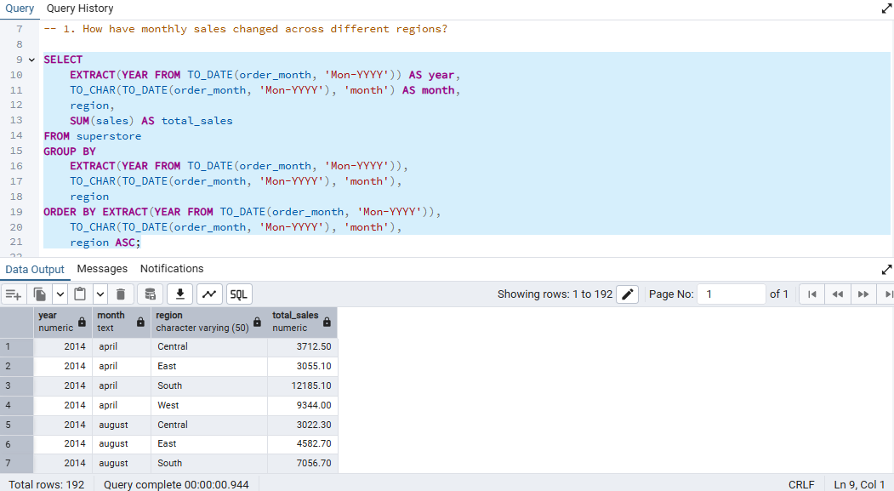

 - What is the total profit by product category and region?

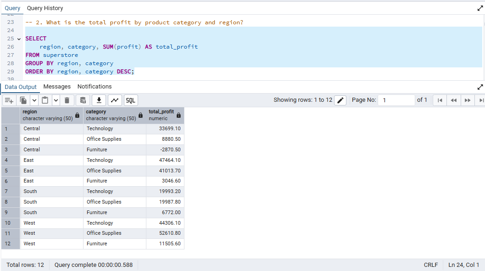

 - Which products rank highest in sales and lowest in profit?

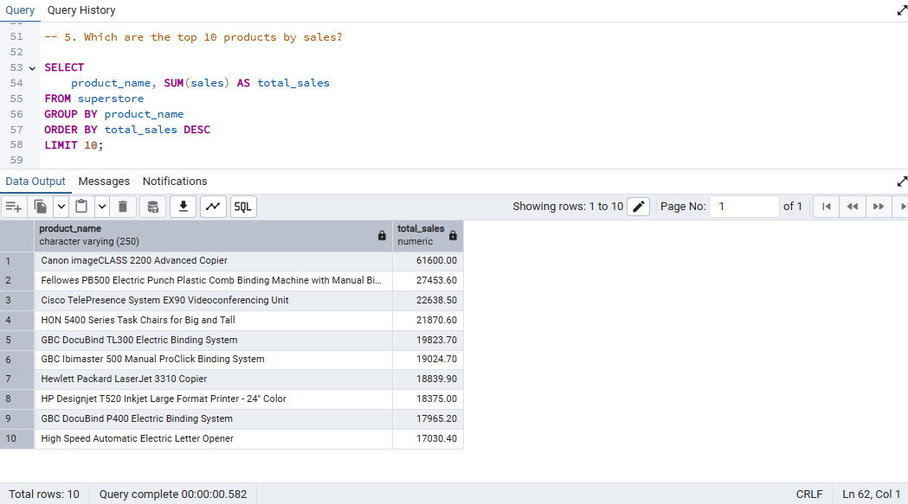

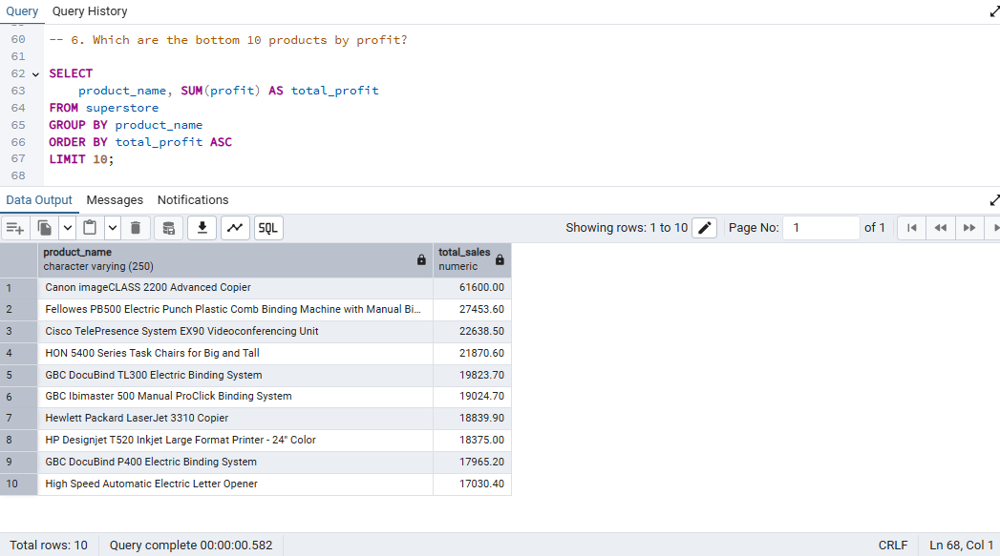

 - How do discounts above 20% affect profitability?

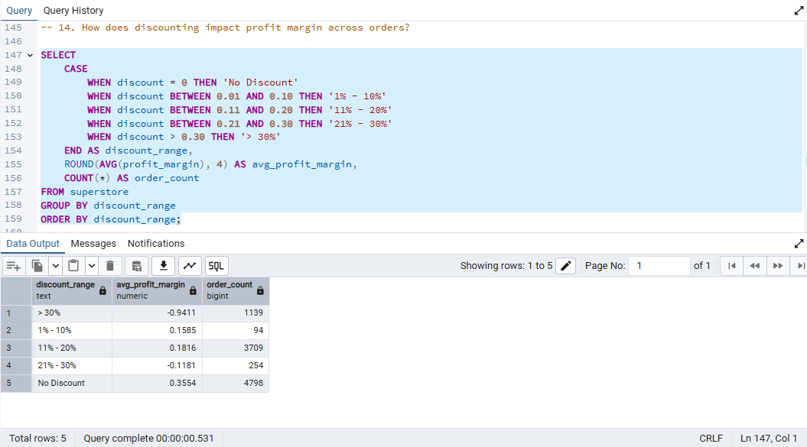

 - Which consumer segment drives the most revenue?

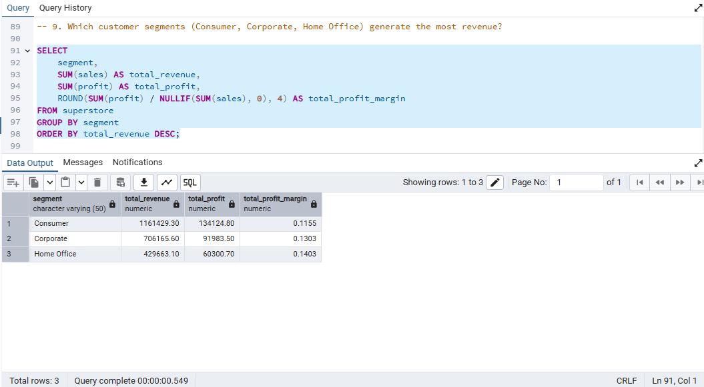

 - Which region shows consistent YoY growth?

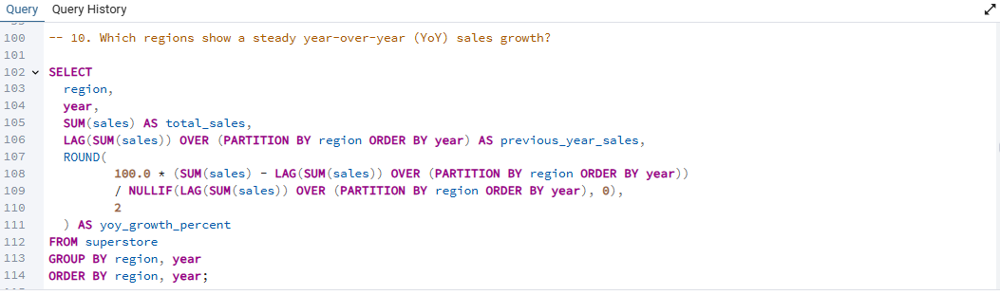

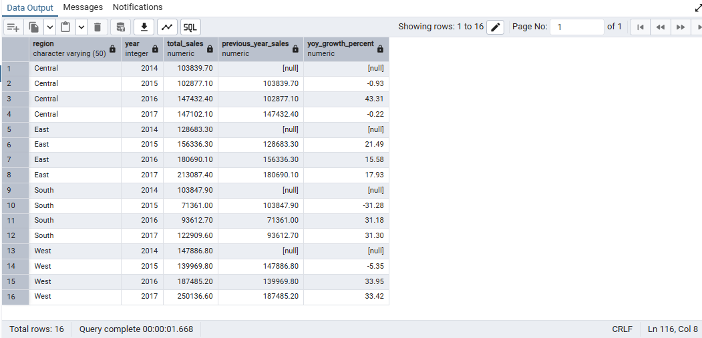

# Data Modeling
## Star Schema Design
In Power BI, the cleaned Excel dataset was structured using a star schema to improve performance and enable flexible analysis. The schema was designed around a central Fact Table and supporting Dimension Tables, such as:
 - Fact_Sales: Contains transactional data including Order ID, Product ID, Sales, Quantity, Profit, and Discount
 - Dim_Date: A custom calendar table used to support time intelligence (e.g. YoY growth)
 - Dim_Product: Includes Product Name, Category, and Sub-Category
 - Dim_Customer: Contains Customer ID, Segment, and Region
 - Dim_Shipping: Includes Shipping Mode and Order Priority

This structure made it easier to slice and drill down into sales metrics by region, customer segment, product category, and time period.
## Table Relationships
Relationships between tables were created using one-to-many (1:* ) joins:
 - Dim_Date[Date] → Fact_Sales[Order Date]
 - Dim_Product[Product ID] → Fact_Sales[Product ID]
 - Dim_Customer[Customer ID] → Fact_Sales[Customer ID]
 - Dim_Shipping[Shipping Mode] → Fact_Sales[Shipping Mode]

These relationships enabled efficient filtering, grouping, and aggregation in the report visuals.

All relationships were created and managed in Power BI’s Model View, with referential integrity maintained across tables.

# DAX Calculations
## Core Measures
Several key performance indicators (KPIs) were calculated using DAX to enable accurate business insights. These include:
 - DAX Total Sales = SUM(Fact_Sales[Sales])
 - DAX Total Profit = SUM(Fact_Sales[Profit])
 - DAX Profit Margin (%) = DIVIDE([Total Profit], [Total Sales])
 - DAX Total Quantity = SUM(Fact_Sales[Quantity])

## Time Intelligence
To track growth and trends over time, time-based DAX calculations were created using a custom date table.
 - Sales YoY Growth (%)

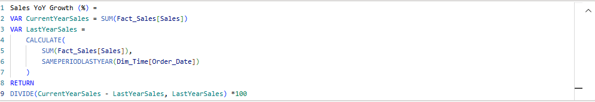

 - Formatted YoY Growth for KPI Card

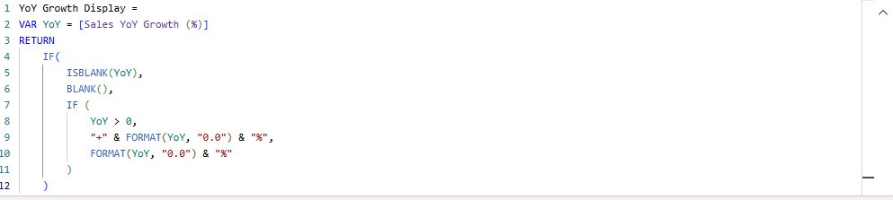

 - Formatted Profit Margin

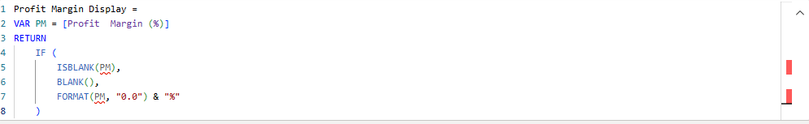

These DAX measures powered KPI cards and visual insights across multiple dimensions such as region, segment, and category.

# Dashboard Design
## Visual Used
The dashboard was designed to highlight key sales trends and product performance, using visuals that make comparisons and patterns easy to interpret:
 - Line Chart: Sales Trend by Segment (Shows how each customer segment performs over time, revealing seasonality and growth patterns)
 - Tree Map: Sales by Region (Provides a proportional view of total sales across regions, making it easy to spot the highest and lowest contributors)
 - Bar Chart: Top 10 Products by Sales (Highlights the highest-grossing products, enabling stakeholders to focus on best-sellers)
 - Slicers: Segment, Category, and Region (Allow users to filter the dashboard dynamically and drill into specific areas of the business)

## User Interactions
The dashboard includes interactive features to support deep dives and comparative analysis:
 - Multi-select Slicers enable users to compare performance across different regions, categories, or segments
 - Hover tooltips reveal details on sales values without overcrowding the visuals
 - All charts are responsive to slicer selections, enabling dynamic exploration of the data

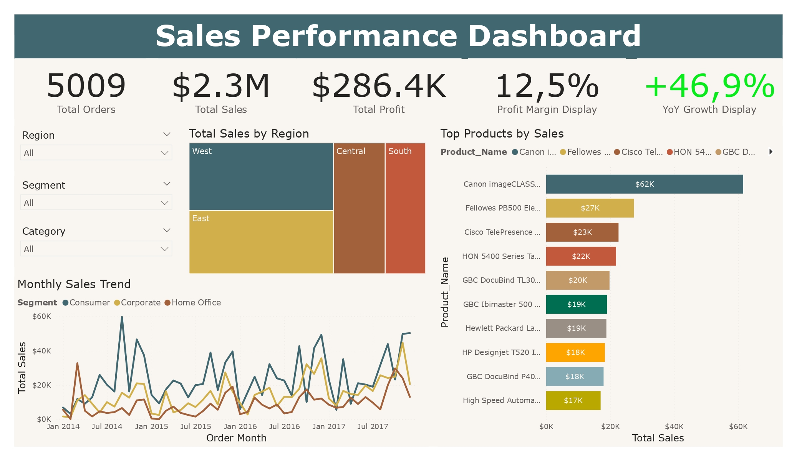

This interactive layout empowers users — particularly the Regional Sales Director — to analyse trends, identify growth opportunities, and spot underperforming areas with just a few clicks.

# Key Insights
## Trends Identified
Based on the sales data and visual analysis, several key trends emerged:
 - Sales performance varies significantly by segment: The line chart shows that the Consumer segment consistently leads in total sales, followed by Corporate. The Home Office segment lags behind, especially during Q2.
 - Regional contribution is uneven: The tree map reveals that one or two regions (e.g., West or East) dominate total sales, while others contribute far less. This indicates potential opportunity or risk depending on business goals.
 - Top-selling products are concentrated: The bar chart highlights that a small group of products drives a large portion of sales. These top 10 products could be prioritised in inventory planning and promotions.

## Recommendations
 - Focus on underperforming regions and segments: Targeted marketing or discounts could help grow underutilised areas like South or the Home Office segment.
 - Leverage top products for bundled promotions: Cross-selling high-performing items with lower-performing ones may increase overall basket size and revenue.
 - Monitor trends by segment more closely: The seasonality in sales trends suggests that certain segments peak at different times — aligning promotions accordingly could improve timing and conversions.

These insights offer immediate opportunities to optimise sales strategy, marketing focus, and product planning.

